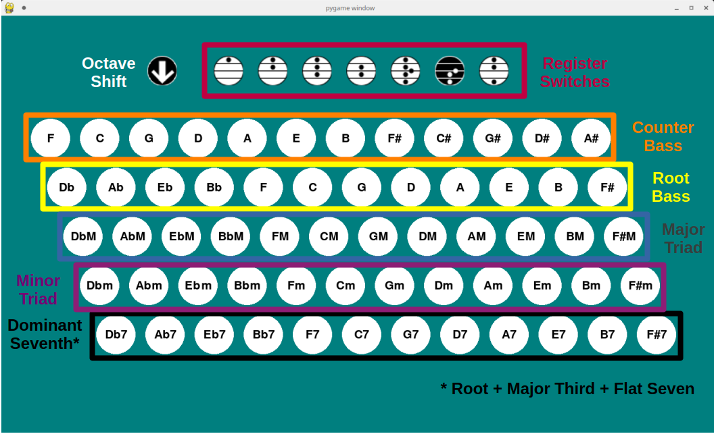

<!-- markdown-toc start - Don't edit this section. Run M-x markdown-toc-refresh-toc -->
**Table of Contents**

- [Conchord: A keyboard & mouse controlled MIDI stradella emulation](#conchord-a-keyboard--mouse-controlled-midi-stradella-emulation)
    - [Introduction](#introduction)
    - [Installation](#installation)
    - [Operation](#operation)
    - [MIDI](#midi)
    - [Buttons](#buttons)
        - [Register switches (top row)](#register-switches-top-row)
        - [Root Bass (third row)](#root-bass-third-row)
        - [Counter Bass (second row)](#counter-bass-second-row)
        - [Major Triad (fourth row)](#major-triad-fourth-row)
        - [Minor Triad (fifth row)](#minor-triad-fifth-row)
        - [Dominant Seventh (sixth row)](#dominant-seventh-sixth-row)
    - [Keyboard](#keyboard)

<!-- markdown-toc end -->

# Conchord: A keyboard & mouse controlled MIDI stradella emulation
## Introduction


Info on the accordion stradella layout that this emulates can be found [here](https://en.wikipedia.org/wiki/Stradella_bass_system).

This virtual button board is designed to be used directly from a computer keyboard, with a midi controller providing velocity control if needed. You can control it with a mouse too.

But why would you do this? I hear you ask. 

Why not buy an accordion, or a v-accordion?

Because I suffer from chronic pain, and most physical instruments are impossible for me to play. However most of the time, a computer keyboard isn't. Additionally the stradella layout (and the isomorphic button layout of the right hand of button the accordion, which I might make later) is a really good layout for simple accompaniement.

So I made this.

## Installation
Create a python virtual environment with your tool of choice, and install the necessary libraries from the `requirements.txt` file:

```
pip install -r requirements.txt
```

## Operation
Activate your virtual environment, and run conchord using `python`:

```
python conchord.py
```

**Be aware that conchord is a MIDI instrument, and generates no sound of its own!**

Conchord outputs software MIDI messages which can be sent to your software synthesizer of choice.

In the following diagram `Ubuntu Studio` (version 24+ for significantly less configuration challenges) provides connections between software MIDI 'devices' using the `patchance` program.


Here I'm using a MIDI controller (`faderfox EC4`) to provide MIDI expression control to conchord (labelled as `RtMidiIn/Out Client`), and outputting MIDI from conchord to the qsynth synthesizer, which generates the sounds sent to my speakers.

This relies on configuration of `JACK` and `ALSA` or `pipewire` servers that is provided out of the box in `Ubuntu Studio 24+` (and probably some other linux distributions), but not by default for most linux distributions.

I haven't tested this on Windows yet. It might work, who knows what the magic of python is capable of.

## MIDI
By default conchord sends MIDI messages on MIDI channel `0`.

Conchord also /listens/ for MIDI expression (CC 11) messages, by default on channel `0`. It will interpret the `value` of these messages as the `velocity` to play notes with.

Both the input and output MIDI channels can be changed manually in `conchord.py`

## Buttons
Conchord is fully mouse controllable, although that's an awful way to control it. Nevertheless it does make it easier to get familiar with the layout and functions, illustrated below:



### Register switches (top row)
The top row contains the `Octave Shift` button and the `Register Switches`. For information on the function of the `Register Switches` see [here](https://en.wikipedia.org/wiki/Stradella_bass_system#Register_switches). Since it is a virtual accordion, conchord emulates additional reed ranks by adding duplicates of the button's notes in higher or lower octaves. The characteristic contralto sound/detuned-reed interaction can't be emulated in MIDI, so conchord simply doubles the tenor line to add more body to the sound (if a contralto register is selected).

The `Octave Shift` button is not present on a real stradella layout, but I've added it because different MIDI voices sound better at higher or lower octaves. When the `Octave Shift` is on (background black, default), all notes are shifted down an octave compared to when it is off (background white).

### Root Bass (third row)
The third row contains the `Root Bass` notes. Pressing any of these buttons plays a single note (which may be doubled at higher or lower octaves, according to the selected register switch). This note is also the `Root` note of the chord buttons in the rows below.

### Counter Bass (second row)
The notes in the second row are a major third above the `Root Bass` notes that they correspond to. Pressing any of these buttons plays a single note (which may be doubled at higher or lower octaves, according to the selected register switch).

### Major Triad (fourth row)
The buttons on the fourth row play a major triad based on the `Root Bass` above it i.e. root + major third + major fifth. Each note in this chord may be doubled at higher or lower octaves, according to the selected register switch.

### Minor Triad (fifth row)
The buttons on the fifth row play a minor triad based on the `Root Bass` above it i.e. root + minor third + major fifth. Each note in this chord may be doubled at higher or lower octaves, according to the selected register switch.

### Dominant Seventh (sixth row)
The buttons on the sixth row play a dominant seventh based on the `Root Bass` above it. This seventh is missing the major fifth i.e. root + major third + flat seventh. Each note in this chord may be doubled at higher or lower octaves, according to the selected register switch.

## Keyboard

All of the note buttons (second row down) are mapped to keyboard buttons (this assumes a UK QWERTY layout, but you could modify the mapping in `stradella.py`):


The counter bass row is controlled using the function keys (`F1` - `F12`).

The root bass row is controlled using the number row (`1` - `=`)

The major triad row is controlled using the `qwerty` row (`q` - `]`)

The minor triad row is controlled using the `asdf` row (`a` - `#`)

The dominant seventh row is controlled using the `zxcv` row (`z` - `/`). Since this row is shorter than the others, there are no keys for `B7` and `F#7`, and they can only be played by mouse.
